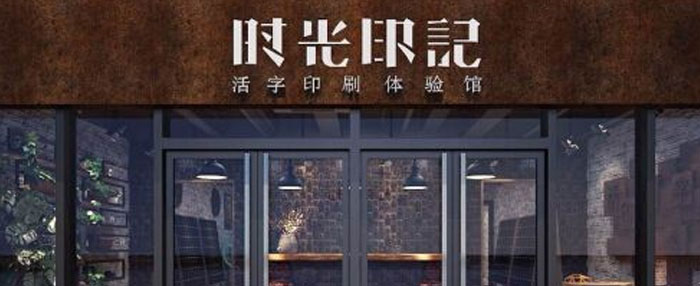
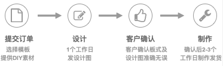
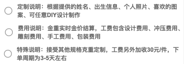
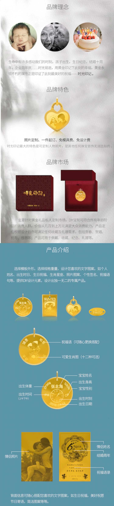

## 接口返回统一格式：
```javascript
response = {
    status: true/false   0/1                //表示请求成功与否
    data:   json对象 数组对象 字符串等      // 表示返回的结果（根据情况可返可不返）
    msg:    提示信息                        // （看情况，可返可不返）
}
```
## 所有列表 返回格式统一
request: 
```javascript
{
        rows: 10,             // 每页显示多少条
        current: 1            // 请求页码
        // ....  其它
}
```
```javascript
response = {
    status: true/false   0/1                //表示请求成功与否
    data:   []      // 数组
    page: {                      // 页码信息
            totals: 0             // 总共多少页
    }
    msg:    提示信息                        // （看情况，可返可不返）
}
```


## 登录
### 登录 /login/login.vue
request： 
```javascript
{
        tel: ''  // 手机号码
        password: '' // 密码
}
```
response:
```javascript
data: {
        Authorization: ''   // 登录的唯一标识
        uid: ''  //           用户的id...
}
```

### 获取验证码 
request:
```javascript
{
        tel: ''  // 手机号码
}
```

### 找回密码 /login/findpassword.vue
request:
```javascript
{
        tel: ''    // 手机号
        code: ''    // 验证码
        password: ''   // 密码
}
```

### 注册
request:
```javascript
{
          tel: '',  // 手机号
          code: '',  // 验证码
          password: '', //  密码
          companyname: '',  //  公司名称
          brand: '',  //  店铺品牌
          position: '', //  店铺位置
          address: '',  //  详细地址
          username: '',  //  联系人员姓名
          usertel: '',   //  联系人员电话
}
```

### 地区列表
response:
```javascript
data: [
    {
            id: '',
            label: '北京',
            child: [
                {
                        id: '',
                        label: '市辖区',
                        child: [
                            {
                                    id: '',
                                    label: ''
                            }
                        ]
                }
            ]
    }
    // .....
]
```


## 商家中心 /mine/index
### 获取用户信息
request:
```javascript
{
        uid: ''    // 用户标识
}
```

response
```javascript
data: {
       avatar:  ''   // 头像
       tel: ''       //  手机号
       companyname: '',  // 公司名称
       brand: '',  //  店铺品牌
       position: '',  //  店铺位置
       address: '',  // 详细地址
       username: '',  // 联系人员
       usertel: '',   //  联系电话
}
```


### 退出登录
request: 
```javascript
{
        uid: ''   // 用户标识
}
```

### 修改密码
request
```javascript
{
         oldpassword: '', // 旧密码
         password: ''   //  新密码 
}
```

### 上传图片
request:
```javascript
{
        file: ''    // 图片信息  单张或多张
}
```
response:
```javascript
data: ''   // 图片路径 （多张时返回数组，不方便处理的话可以返回字符串，以英文逗号分隔）
```
### 删除图片
request
```javascript
{
        url: ''   // 图片地址
}
```

### 修改资料  /mine/info.vue
request: 
```javascript
{
          avatar: '',  // 用户头像
          companyname: '',  // 公司名称
          brand: '',  //  店铺品牌
          position: '',  //  店铺位置
          address: '',  // 详细地址
          username: '',  // 联系人员
          usertel: '',   //  联系电话
}
```

### 收货地址 列表  /mine/address.vue
request:
```javascript
data: [
     {
             id: '1',                                        
             name: '张三', 
             tel: '13800018000', 
             address: '广东省深 02室利1102室', 
             isDefault: true                               // 是否默认
     }
]
```
### 添加地址
request
```javascript
 {
                isDefault: false,  //  是否默认
                id: '',   //id
                name: '',   // 姓名
                tel: '',  //  电话
                position: '',   //  所在地区
                address: '',  //  详细地址
}
```

### 删除地址
request:
```javascript
{
        id: ''   // 地址id
}
```

### 设置默认地址
request
```javascript
{
         id: ''   // 地址id
}
```

### 公告列表
response 
```javascript
data: [
     {
             id: '1',
             date: '2018.11.15 12:00', 
             title: '关于商家加盟最新条款事宜', 
             describe: '关于商家加盟最新条款事宜,关于商家加盟最新条款事宜,关于商家加盟最新条款事宜'
     }
]
```

### 获取公告详情、加盟合作、联系我们
request
```javascript
{
        id: ''
}
```
response
```javascript
data: {
          id: '1',
          date: '2018.11.15 12:00',
          title: '关于商家加盟最新条款事宜',
          describe: '关于商家加盟最新条款事宜,,'
     }
```

## 首页  /home/index.vue

###  全局接口
response
```javascript
{
      webname: '',   // 网站名称
      logo: './static/img/logo.jpg',   // Logo
      ads: {
          home_banner: [   // 首页轮播图
              {
                 id: '1',
                 link: 'http://baidu.com',    // 图片链接
                 url: './static/img/ad1.jpg',   // 图片地址
                 type: '1'                     //  1: 图片  2： 视频
              },
              {
                  id: '2',
                  link: '',
                  type: '2',
                  url: './static/img/ad1.jpg',
                  videoUrl: 'http://220.112.193.197/mp4files/A18400000009E79A/vjs.zencdn.net/v/oceans.mp4' // 视频地址
              },
          ],
          new_arrival: {link: 'http://baidu.com', url: './static/img/ad1.jpg'},  //  首页 新品专区(link 有值就跳转，否则不跳）
          hot_sale: {link: 'http://baidu.com', url: './static/img/ad1.jpg'},  // 首页 热卖专区(link 有值就跳转，否则不跳）
          goods_banner: {link: 'http://baidu.com', url: './static/img/ad1.jpg'},  //  商品定制 头部(link 有值就跳转，否则不跳）
      }
}
```

### 新品专区, 热卖专区，商品列表
response
```javascript
data: [
   {id: '1', imgUrl: './static/img/goods.png', title: '宝宝生辰定制牌'}
]
                        
// 热卖专区，商品专区需要返回页码信息
page: {
    totals: 0
}
                        
```
#### 商品列表 请求参数
request:
```javascript
{
         keyword: '',     // 搜索关键词
         type: ''   // 分类
}
```

## 商品分类 /goods/goodlist.vue
response
```javascript
data: [
   {title: '新品上牌', type: 1},
   {title: '节日限定', type: 2},
   {title: '情侣定制', type: 3},
   {title: '宝宝定制', type: 4},
   {title: '父母父母', type: 5},
]
```

## 商品详情 /good/detail.vue
request: 
```javascript
{
        id: ''
}
```

response
```javascript
{
            id: 1,
            title: '宝宝生辰定制牌完美工艺创意可爱吊坠装饰吉祥款V3200B20',
            imgs: ['./static/img/g3.jpg',  './static/img/ad3.jpg'],        // 轮播图
            tag: [                                                         // 标签
                {id: 1, title: '新品爆款', backColor: '#ff9933'}, 
                {id: 1, title: '特价热卖', backColor: '#cc6666'},
                ], 
            process: '',    //  定制流程
            rules: '',     //  规则说明
            detail: '',  //  详细介绍
}
```


## 商品定制 /good/detail.vue

### 获取信息
request
```javascript
{
        id: ''    // 商品id
}
```

response
```javascript
{
  purchase: {   // 定制参数
    fontColor: 'blue',
    fontFamily: '微软雅黑',
    back: {    // 定制背面
      backgroundImg: './static/img/g1.png',
      scale: 1,
      params: [
        {enable: true, fontsize: '', left: 150, radio: '', rotate: '', text: '平安', title: '祝福祝福', top: 92, type: 1},
        {enable: true, fontsize: '', left: 150, radio: '', rotate: '', text: '健康', title: '祝福祝福', top: 92, type: 1},
        {enable: true, fontsize: '', left: 150, radio: '', rotate: '', text: '活泼', title: '祝福祝福', top: 92, type: 1},
        {enable: true, fontsize: '', left: 150, radio: '', rotate: '', text: '', title: '祝福祝福', top: 92, type: 1},
        {enable: true, fontsize: '', left: 150, radio: '', rotate: '', title: '宝宝照片', top: 92, istext: false, type: 3}
      ]
    },
    front: {   // 定制正面
      backgroundImg: './static/img/goods.png',
      scale: 0.7967914438502673,
      params: [
        {enable: true, fontsize: '24px', left: 221, radio: '40', rotate: '50', text: '50CM', title: '宝宝身高', top: 128, type: 1},
        {enable: true, fontsize: '30px', left: 106.67959050484066, radio: '', rotate: '', text: '张北海', title: '宝宝姓名', top: 129.26845637583892, type: 1},
        {enable: true, fontsize: '24px', left: 92, radio: '50', rotate: '180', text: '2018.07.14', title: '出生日期', top: 305, type: 1},
        {enable: true, fontsize: '24px', left: 44, radio: '', rotate: '', text: 'AM,PM', title: '上午下午', top: 210, type: 2},
        {enable: true, left: 100, rotate: '', istext: true, text: '', title: '出生时间', top: 150, type: 3},
        {enable: true, fontsize: '24px', left: 23, radio: '70', rotate: '-50', text: '3700g', title: '宝宝重量', top: 120, type: 1},
        {enable: true, left: 150, rotate: '30', title: '宝宝星座', top: 92, type: 4,
          url: '',
          iconsid: 1,
          iconlist: [  // 图标列表
            {id: 1, text: '白羊座', url: "http://pic33.photophoto.cn/20141022/0019032438899352_b.jpg",},
            {id: 1, text: '白羊座', url: "./static/img/xz/baiyang.png",},
            {id: 2, text: '金牛座', url: "./static/img/xz/jinniu.png",},
            {id: 3, text: '双子座', url: "./static/img/xz/shuangzi.png",},
            {id: 4, text: '巨蟹座', url: "./static/img/xz/jujie.png",},
            {id: 5, text: '狮子座', url: "./static/img/xz/shizi.png",},
            {id: 6, text: '处女座', url: "./static/img/xz/chunv.png",},
          ]
        }
      ]
    }
  },
  dict: [
    {title: '成色', text: 'Ag999,银镀金,银镀金,银镀金,银镀金,银镀金,银镀金,银镀金'},
    {title:  '重量', text: '20g,30g'},
    {title: '规格', text: '20*23.8mm,20*10.4mm'}
  ]
}
```


### 提交定制信息
request 
```javascript
{
  id: ''                          // 商品id
  purchase: {          //  定制信息(与获取定制信息结构一致)
    front: this.front,
    back: this.back,
    fontFamily: this.purchase.fontFamily,
    remark: this.purchase.remark,
  },
  dict: ['Ag999', '20g,30g', '20*10.4mm']
}
```

response
```javascript
data: '5541515'            // 订单号
```

## 个性定制 /goods/customized.vue
request
```javascript
{
      imgs: '',   //  定制照片  多张图片以逗号分隔（aa.jpg,bb.jpg,cc.jpg)
      fontFamily: '微软雅黑',   //  定制字体
      num: 1,          //  定制数量
      remark: ''        //  定制备注
}
```
response
```javascript
data: '5541515'            // 订单号
```


## 订单

### 订单列表 /order/list
request
```javascript
{
        rows: '',
        current: '',
        type: ''      // 订单类型   1：待确认  2：生产中 3：已发货 4：已取消
}
```
response  
```javascript
data: [
     {
       id: 1,                            // 商品id
       sn: '20181115093150001',           // 订单号
       date: '2018.11.15 09:31:50',      // 日期
       imgUrl: './static/img/goods.png',  // 商品图片
       title: '宝宝生辰定制牌',          // 商品标题
       number: '100',                   // 数量
       fineness: 'Au999',                // 成色、
       weight: '20g',                   // 重量、
       format: '20*23.8mm',            // 规格 
       answer: '请提供客服的详细资料和上传照片，具体内容请查看详情页'   // 客服回复
    },            
]，
page: {
        totals: 0
}
```


### 订单详情 /order/detail.vue

#### 获取订单信息
request
```javascript
{
        sn: ''    // 订单号
}
```
response
```javascript
data: {
        id: 1,
        sn: '20181115093150001',
        date: '2018.11.15 09:31:50',
        imgUrl: './static/img/goods.png',
        title: '宝宝生辰定制牌',
        number: '100',
        fineness: 'Au999',                // 成色、
        weight: '20g',                   // 重量、
        format: '20*23.8mm',            // 规格 
        answer: '请提供客服的详细资料和上传照片，具体内容请查看详情页',   // 客服回复
        address: {                                                     // 地址
          name: '张三', tel: '13800018000', address: '广东省深圳市罗湖区田贝路金利1102室'
        },
        purchase: {             // 定制信息
          fontColor: 'blue',
          fontFamily: 'A',
          back: {
            backgroundImg: '',
            params: [
              {enable: true, fontsize: '24px', left: 221, radio: '40', rotate: '50', text: '50CM', title: '宝宝身高', top: 128, type: 1},
            ]
          },
          front: {
            backgroundImg: './static/img/goods.png',
            params: [
              {enable: true, fontsize: '24px', left: 221, radio: '40', rotate: '50', text: '50CM', title: '宝宝身高', top: 128, type: 1},
            ]
          }
        },
        chat: [     //  沟通记录
          {
            name: '客服',
            date: '2018.11.15 09:31:50',
            text: '最新设计效果图，请确认是否可以进行生产',
            imglist: [
              './static/img/goods.png',
              './static/img/ad1.jpg',
            ]
          },
          {
            name: '我',
            date: '2018.11.15 09:31:50',
            text: '谢谢，收到！'
          }

        ] 
}
```


#### 确认订单, 取消订单
request
```javascript
{
        sn: ''    // 订单号
}
```

#### 沟通记录
request
```javascript
{
         img: '',                       // 图片路径，多张以逗号分隔
         question: ''           // 问题
}
```
 
#### 选择地址
request
```javascript
{
        sn: ''    // 订单号
        addressid: ''  // 地址id
}
```


